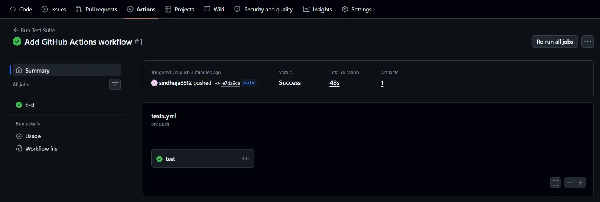

# SauceDemo Test Automation Framework


An automated UI test suite for [saucedemo.com](https://www.saucedemo.com),
built with **Playwright + pytest** using the **Page Object Model**.

Test cases aren't ad hoc — each one was derived first using a
black-box test design technique (equivalence partitioning, boundary
value analysis, decision tables), documented in
[`docs/test_design_rtm.md`](docs/test_design_rtm.md), and then
automated. That traceability is the point of this project: it's not
just "scripts that click things," it's a framework with design
behind it.

## Stack

- **Playwright** — browser automation (auto-waiting, no manual sleeps)
- **pytest** — test runner, fixtures, parametrization
- **pytest-html** — readable HTML report after each run
- **GitHub Actions** — runs the suite on every push, publishes the report as a build artifact

## Project structure

```
saucedemo-test-framework/
├── pages/              # Page Object classes — one per screen
│   ├── login_page.py
│   ├── inventory_page.py
│   ├── cart_page.py
│   └── checkout_page.py
├── tests/              # Test cases, one file per feature
│   ├── test_login.py
│   ├── test_cart.py
│   └── test_checkout.py
├── docs/
│   └── test_design_rtm.md   # Requirements -> test case -> design technique
├── conftest.py          # Shared fixtures (e.g. logged_in_page)
├── pytest.ini
└── requirements.txt
```

## Setup

```bash
# 1. Clone and enter the project
git clone https://github.com/sindhuja8812/saucedemo-test-framework.git
cd saucedemo-test-framework

# 2. Create a virtual environment
python -m venv venv
source venv/bin/activate        # Windows: venv\Scripts\Activate.ps1

# 3. Install dependencies
pip install -r requirements.txt

# 4. Download the browser binaries Playwright needs (one-time)
playwright install
```

## Running the tests

```bash
# Run everything, headless
pytest

# Run with a visible browser window (useful while developing)
pytest --headed

# Run just one file
pytest tests/test_login.py

# Generate an HTML report
pytest --html=reports/report.html --self-contained-html
```

Open `reports/report.html` in a browser afterwards to see results,
including a screenshot on any failure.

## Continuous Integration

Every push to `main` triggers `.github/workflows/tests.yml`, which
installs dependencies, runs the full suite headlessly, and uploads
the HTML report as a downloadable build artifact — visible under the
Actions tab on GitHub.

## What's covered

- **Login**: valid login, invalid username, invalid password, empty
  fields, locked-out account (5 cases)
- **Cart**: adding single/multiple items, cart badge accuracy,
  cart contents matching (3 cases)
- **Checkout**: form validation across all field-presence
  combinations (4 cases)

12 test cases total, all traced back to a requirement and a design
technique in `docs/test_design_rtm.md`.

## CI Results



## Possible extensions

- Sorting and filtering on the inventory page
- Logout flow and session handling
- Visual regression testing for the `visual_user` account
- Swap `pytest-html` for Allure if you want trend graphs across runs